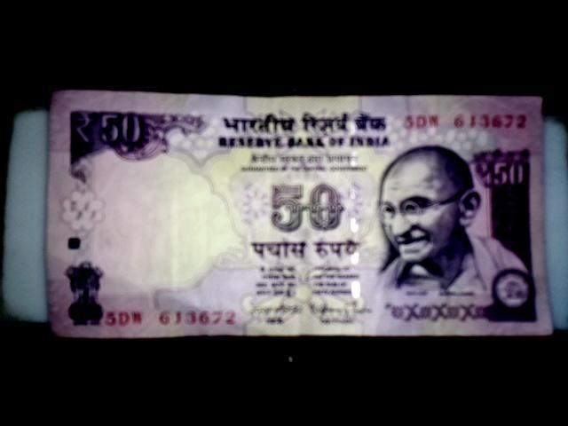
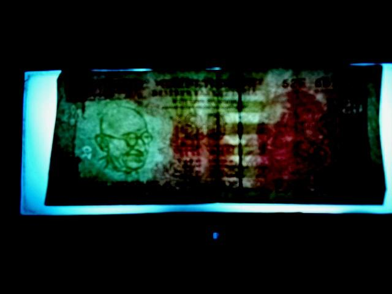
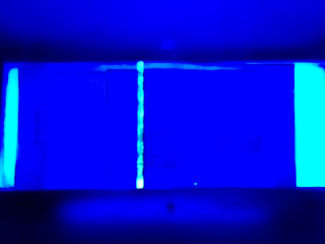

# Fake Currency Identification

| Frontlight  | Backlight | Ultraviolet light |
| ------------- | ------------- | ------------ |
|  |  |  |

## Abstract
Uses Deep Learning Neural Networks to determine whether an Indian currency note is fake or real.
## Technical
Uses retrained MobileNetV2 (and VGG16) image classification models to determine whether an Indian currency note is fake or real. The process happens in three steps:
1. **Currency Classification Model**: Identifies the denomination, type (old or new), face orientation (front or back), and alignment (up or down) from a frontlight image of the note.
2. **Watermark Identification Model**: Identifies whether the note contains the Gandhi watermark under backlight illumination from a backlight image of the note.
3. **Ultraviolet Strip Detection Model**: Identifies whether the note contains a fluorescent strip or not and if yes then whether the strip is continuous or dashed under Ultraviolet illumination from a ultraviolet image of the note.

The models were meant to be integrated together to run on a Raspberry Pi (hence the choice of MobileNet for the architecture) but you can strip and use each model individually if you like. 

Trained and tested on 16 GB of RAM, i7-8750H, and a GTX 1060 all at stock settings.
### A Bit of History
Initially, I tried using KNN-based ORB feature matching to compare features of currency images and detect currency denominations but that ended up being highly inaccurate. I later tried running OCR using Tesseract in hopes of detecting the denomination which sort of worked but more often than not didn't. Eventually, I settled on using Convolutional Neural Networks for my task.

## Getting Started
Explore around the folders in the project and check out the code. I've placed text files at appropriate places/folders to act as instructions that will guide you in case you want to do any sort of training yourself. This repo has all the code files you need for retraining, transfer learning, or testing any of my models.

The models were trained on Indian currency notes but you can retrain them for other note images provided you have sufficiently diverse data, regardless of how big it is. Take my setup as an example, I had five-seven unique images of every note which is not much considering the fact that there are only 10-12 varieties of Indian currency notes. So even though I only had about a 100 or so samples, with the help of randomized data augmentation, I strategically generated a vast and diverse dataset of 9000-12000 images using those very samples.

**NOTE**: The UV model must be supplied UV light images whereas the Watermark model must be supplied backlit images with  the transparent features visible.
#### Cool things you can try when training/retraining
Some suggestions in case you feel experimental or are facing issues with accuracy and loss:

- Freezing layers and adding more output layers. My model doesn't have any additional dense layers apart from the softmax output layer. You could try adding more layers or making certain layers untrainable.
- Changing optimizers, loss functions, and their parameters. By default I use SGD with a learning rate of ``0.001`` for the MobileNet models and RMSProp for the VGG16 models with a learning rate of ```0.0001``` and a decay of ```10^-4```.
- Adding Dropout and Batch Normalization to the output layers.
- Adding/tuning regularizer and initializer parameters to the bias and kernel of layers. 
## Example usage
**NOTE**: I've only included my retrained MobileNetV2 models and not the VGG16 models because the former are much smaller in size (~17 mb) when compared to the 1 gb VGG16 models. If you intend to use VGG16 you will have to train a model from scratch using the code samples I've provided.

### MobileNetV2

```console
foo@bar:~$ cd CNN-based-classification-(PRIMARY)
foo@bar:~$ cd mobilenet-model

# Training a new classification model from scratch using data located in ./dataset/
foo@bar:~$ python3 retrained_mobilenet_train.py

# Testing a pretrained model
foo@bar:~$ python3 retrained_mobilenet_test.py

# Testing a lite version of the same model
foo@bar:~$ python3 lite_run.py

# Converting a Keras .h5 model to tflite
foo@bar:~$ python3 convert_to_lite.py

```

---

### VGG16

```console
foo@bar:~$ cd CNN-based-classification-(PRIMARY)
foo@bar:~$ cd vgg16-model

# Training a new classification model from scratch using data located in ./dataset/
foo@bar:~$ python3 pretrained_vgg16_train.py

# Running a pretrained model
foo@bar:~$ python3 pretrained_vgg16_test.py

# Running a lite version of the same model
foo@bar:~$ python3 lite_run.py

# Converting a Keras .h5 model to tflite
foo@bar:~$ python3 convert_to_lite.py
```

## License

GNU GENERAL PUBLIC LICENSE